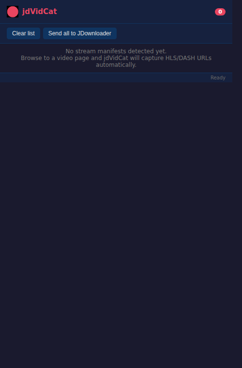
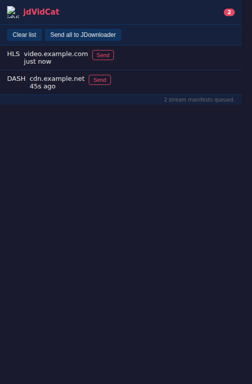

# jdVidCat

**jdVidCat** is a Chrome extension (Manifest V3) that automatically detects HLS and DASH video stream manifests while you browse and hands their URLs off to [JDownloader 2](https://jdownloader.org/) for downloading.

It is built for sites that hide video behind `blob:` playback URLs by capturing the underlying stream manifests (`.m3u8` / `.mpd`) and queueing them in JDownloader automatically.

## How It Works

Modern video streaming sites (Twitch, Vimeo, etc.) use `blob:` URLs backed by HLS (`.m3u8`) or DASH (`.mpd`) adaptive streams. These streams can be gigabytes in size, making in-browser downloading impractical. Instead, jdVidCat acts as a **network sniffer**:

1. It monitors all network requests using the `chrome.webRequest` API.
2. When it detects a request to an `.m3u8` (HLS) or `.mpd` (DASH) manifest, it captures the URL.
3. It immediately POSTs that URL to JDownloader 2's local **Click'N'Load** API (`http://127.0.0.1:9666/flash/add`), which queues the stream for download.
4. JDownloader 2 handles the download and stitching of stream segments into a single video file.

## Prerequisites

- [JDownloader 2](https://jdownloader.org/) must be installed and running.
- JDownloader's built-in web server must be enabled (it is on by default on port **9666**).  
  Enable it via: *Settings → Advanced Settings → Remote API → enabled = true*

## Installation

1. Download the latest `jdVidCat.zip` from the [Actions](../../actions) artifacts.
2. Unzip the file.
3. Open Chrome and go to `chrome://extensions/`.
4. Enable **Developer mode** (top-right toggle).
5. Click **Load unpacked** and select the unzipped folder.

## Screenshots

### Popup (empty state)



### Popup (captured manifests)



## Usage Guide

1. Start [JDownloader 2](https://jdownloader.org/) and confirm its built-in web server / Click'N'Load endpoint is enabled on `127.0.0.1:9666` (see **Prerequisites** above).
2. Open a page that plays HLS or DASH video streams (for example, Twitch or Vimeo).
3. Let the video start playing so the manifest request is made.
4. jdVidCat automatically captures manifest URLs and sends them to JDownloader.
5. Click the jdVidCat extension icon to review captured URLs in the popup.
6. Use **Send** on a single row to re-send one manifest, or **Send all to JDownloader** to queue everything.
7. Use **Clear list** to reset the popup list.

## Permissions Used

| Permission | Reason |
|---|---|
| `webRequest` | Monitor network traffic to find stream manifests |
| `webNavigation` | Reset per-tab deduplication on page navigation |
| `tabs` | Clean up state when a tab is closed |
| `storage` | Persist captured URLs for the popup |
| `notifications` | Notify when a stream is sent to JDownloader |
| `http://127.0.0.1:9666/*` | Communicate with JDownloader's local API |

## Building

```bash
zip -r jdVidCat.zip manifest.json background.js popup.html popup.js icons/
```

The CI workflow (`.github/workflows/build.yml`) validates all files and produces the `jdVidCat.zip` artifact on every push.
